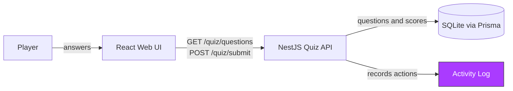

# Architecture

## 1. What it does

A web quiz that teaches Spec-Driven Development: players answer SDD questions
one at a time and get an instant, explained score.

## 2. The diagram

## 3. How we used AI

| Feature | What we did | What it changed |
| --- | --- | --- |
| Plan Mode / Spec-Driven Dev | Read `spec/activity-log.md`, found the four `[NEEDS CLARIFICATION]` markers, resolved each before writing any code | `spec/activity-log.md` now has a filled *Decisions* table (tie-break order, redaction rule, inclusive range, empty-result semantics) that the implementation follows exactly |
| TDD | Wrote 13 failing tests against the empty `ActivityLog` stub, then the `REQ-QUIZ-008` percentage tests, confirmed red for the right reason before writing code | `docs/agent-evidence.md` §1–2 has the actual red-then-green Jest/Vitest output |
| Caveman | Used terse mode for a quick confirmation step during the percentage change | One-line terse note captured in `docs/agent-evidence.md` §3 |
| Second Model | Ran an adversarial review pass against the spec and tests | Found 5 untested edge cases (e.g. redaction not descending into arrays, no e2e test on the quiz routes) — disclosed as a **weak** review since no second model was actually switched in |
| Documentation | Generated `README.md` from the real source tree and test files, not from memory | Root README with run/test steps, architecture, decisions, and known gaps |

## 4. What we'd do next

- Add e2e tests that hit `/quiz/questions` and `/quiz/submit` over real HTTP — today only the unit-level `QuizService` is tested.
- Make `ActivityLog` redaction recurse into arrays, and decide whether a whitespace-only actor should count as empty (both found in review, neither fixed yet).
